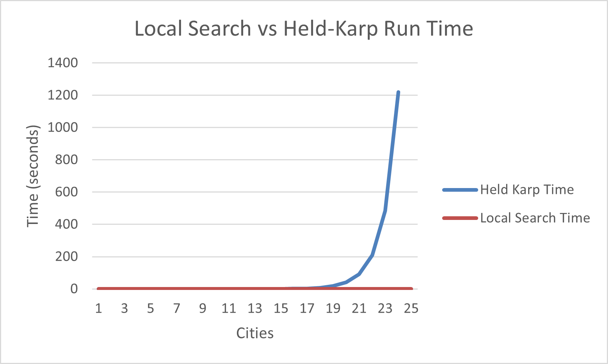
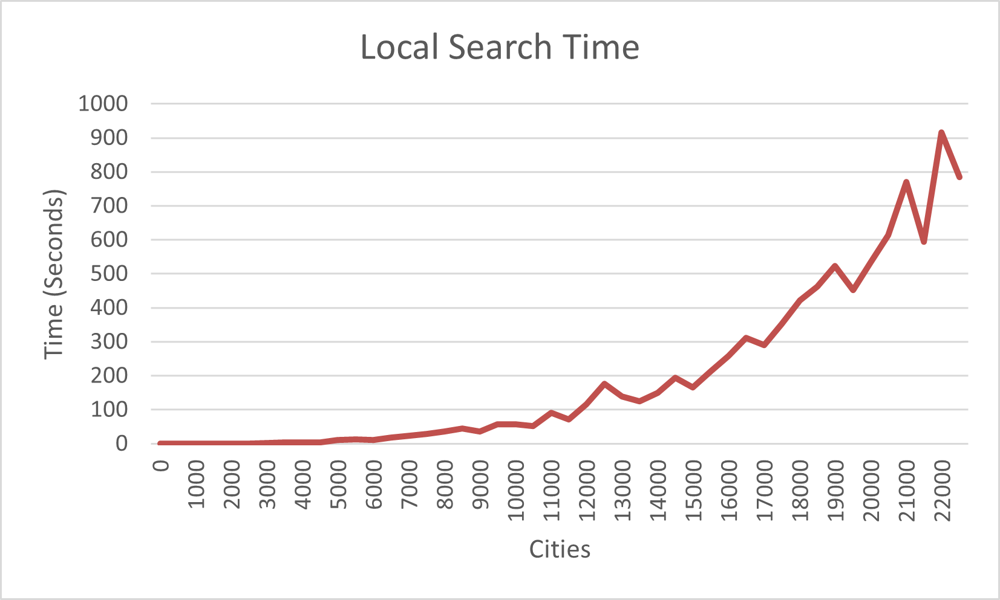
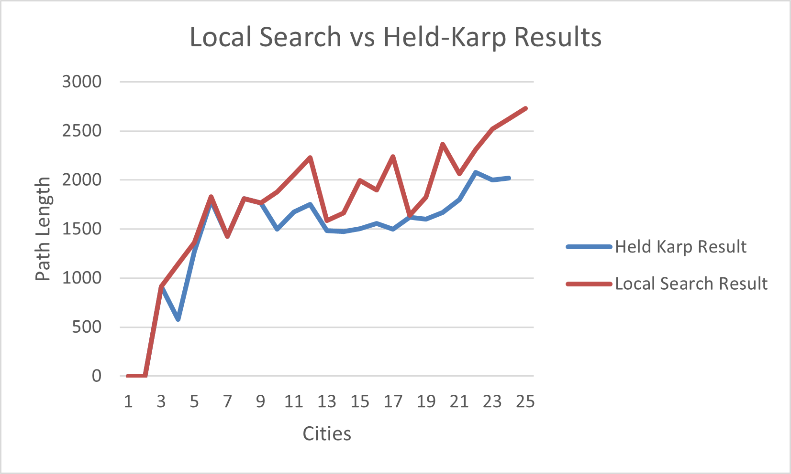
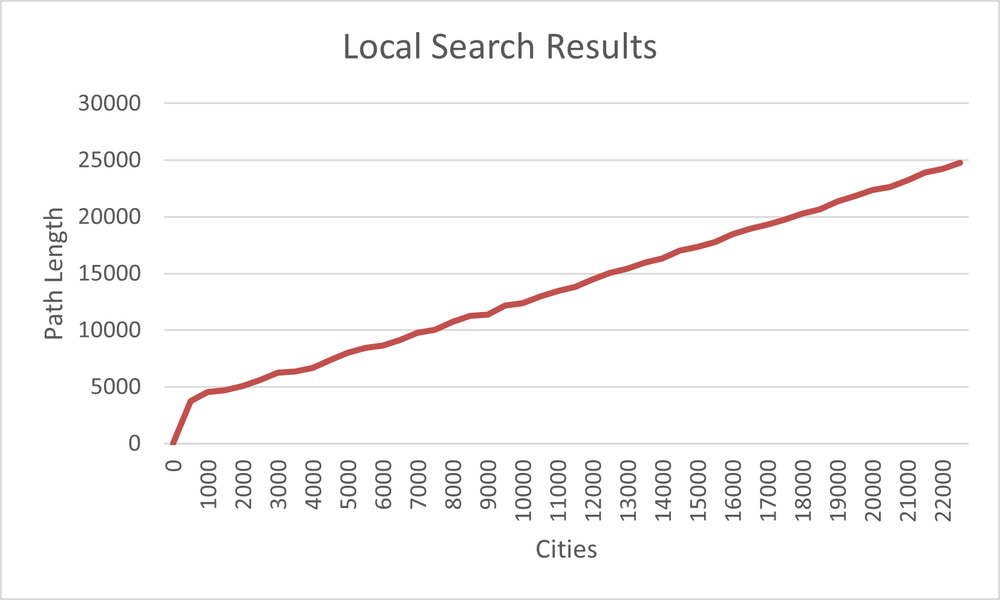

# Traveling Salesperson Problem -- Empirical Analysis

For this exercise, you'll need to take the code from the TSP Held-Karp and TSP
Local Search exercises. This can be your own implementation or somebody else's.
You will now do an empirical analysis of the implementations, comparing their
performance. Both the Held-Karp and the Local Search algorithms solve the same
problem, but they do so in completely different ways. This results in different
solutions, and in different times required to get to the solution.

Investigate the implementations' empirical time complexity, i.e. how the runtime
increases as the input size increases. *Measure* this time by running the code
instead of reasoning from the asymptotic complexity (this is the empirical
part). Create inputs of different sizes and plot how the runtime scales (input
size on the $x$ axis, time on the $y$ axis). Your largest input should have a
runtime of *at least* an hour. The input size that gets you to an hour will
probably not be the same for the Held-Karp and Local Search implementations.

In addition to the measured runtime, plot the tour lengths obtained by both
implementations on the same input distance matrices. The length of the tour that
Held-Karp found should always be less than or equal to the tour length that
Local Search found. Why is this?

Add the code to run your experiments, graphs, and an explanation of what you did
to this markdown file.

## Runtime Notice

If you look at the data, you may realize that neither algorithm reached an hour 
for runtime. For the held-karp algorithm, this is because it seemed to just stop 
when the input size was 24 cities. I left the program running for about 10 hours, 
and it would not update anymore. As a result, I created another file to test local 
search and resume where the previous attempt left off. This failed to reach an hour 
because it started using too much memory, even after I allocated more to the JavaScript 
heap. The program crashed after 22,500 cities. 

That said, I do still have a decent amount of data, so I think I will still be able to 
have a relatively decent analysis. 

## Testing Method 

My main code is in code.js, which tested my solutions to both exercises. It increases 
the input size by generating new symmetrical distance matrices based on the last matrix 
generated. The entry where the row and column indices match is always 0. I then run and 
time both functions with that matrix. Ideally, it would stop running one of them when it 
reaches an hour, then continue with the other until it reaches an hour. While doing this, 
it exports the data to an excel file that stores all my data. Additionally, because I 
noticed the program would start having issues with input sizes of 24, I started writing
the last matrix generated to a text file so that I could resume where the program failed. 

After code.js failed, I also ran lsTest.js. This basically does the same thing as code.js, 
but just tests local search until it fails or reaches an hour. At this point I also start 
increasing the input size by 500 because incrementing by one wasn't going to cut it when 
the input size needed to be well over 20,0000. Finally, I manually created graphs using 
the excel file and added them to a different sheet. 

## Analysis

Below, you will see the graph comparing the runtimes of the two algorithms for the first 
24 cities: 

As you can see, the time to run local search was incredibly insignificant compared to the 
held-karp algorithm. Local search is only running in a fraction of a second, while held-karp
gets up to just over 20 minutes for 23 cities. 

In fact, it takes much longer for the time to become significantly noticeable as 
seen here: 

It is worth noting that the graph for held-karp is much smoother than that for local 
search. This is likely because local search generates a random path and only stops 
can no longer improve it. This causes the runtime to vary significantly. 

However, as you can see here, the runtime does come at a cost of precision: 

The result of the held-karp algorithm is always less than or equal to that of 
the local search algorithm. At some points they do meet, but the result of local 
search is usually higher. This is because held-karp is an actual solution to 
the problem, while local search only approximates the result by reaching a local 
minimum (which could be the absolute minimum). Of course, for both algorithms, 
you will see a relatively linear relationship, showing that as the input size 
increases, so does the distance. 

This relationship is highlighted more so in the remaining data for local search 
here: 

## Extra Help

Because I was writing to an excel file, I needed a way to do this. I got the information 
I needed from https://medium.com/@me.mohamed.elnagar/working-with-xlsx-files-in-javascript-a-beginners-guide-b649a06de8fc 
and https://www.npmjs.com/package/xlsx

I also watched https://www.youtube.com/watch?v=Wt_i73XFb7M for some general information 
on file I/O. 

To help with timing functions, I used https://stackoverflow.com/questions/313893/how-to-measure-time-taken-by-a-function-to-execute

"I certify that I have listed all sources used to complete this exercise, 
including the use of any Large Language Models. All of the work is my own, 
except where stated otherwise. I am aware that plagiarism carries severe 
penalties and that if plagiarism is suspected, charges may be filed against 
me without prior notice." 
